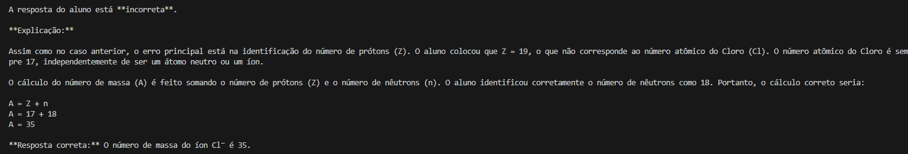
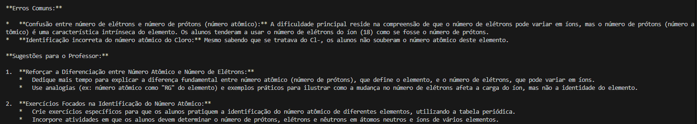

# gemini-alura

Apresento um programa inovador para otimizar a correção de exercícios físicos. Alunos submetem imagens de suas execuções, as quais são analisadas e comparadas com um gabarito visual fornecido pelo docente.

O sistema oferece feedback individualizado aos alunos, destacando acertos e desvios. Adicionalmente, proporciona ao professor uma visão geral do desempenho da turma, identificando tendências e áreas de dificuldade coletiva.

Com base nessa análise, o programa sugere ações pedagógicas direcionadas, visando aprimorar o processo de ensino-aprendizagem e otimizar os resultados da turma. Esta ferramenta representa uma solução eficiente para a avaliação e o acompanhamento do desenvolvimento motor dos alunos.

Para rodar basta inserir uma chave de api válida no arquivo Main.py (procure por 'Insira_sua_chave_aqui' :D)
tendo instalado as dependências

<!-- Dependecias -->

pip install ipython

pip install -q google-adk

pip -q install google-genai

pip install google-generativeai Pillow
